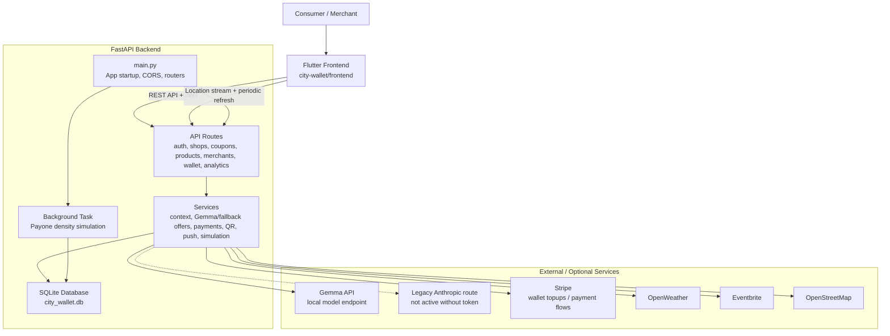
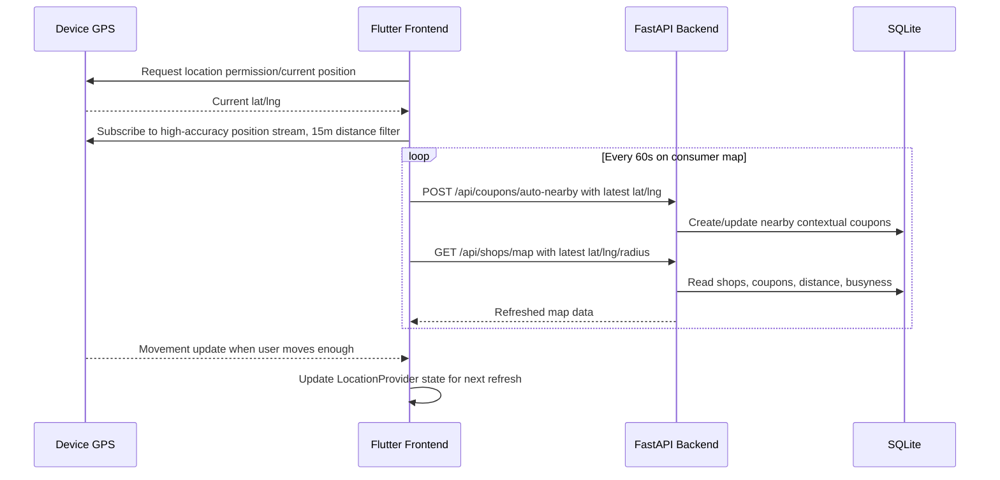
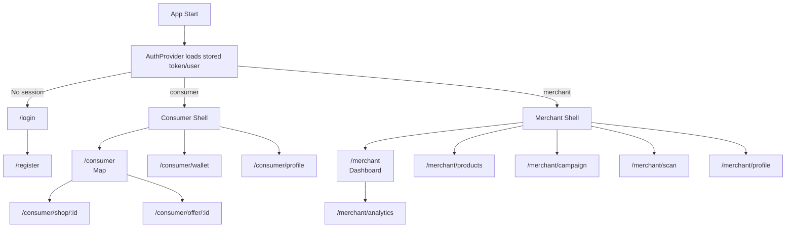
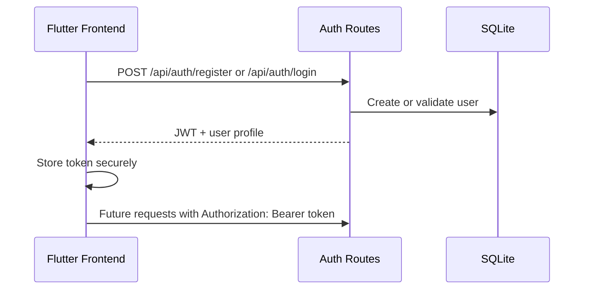
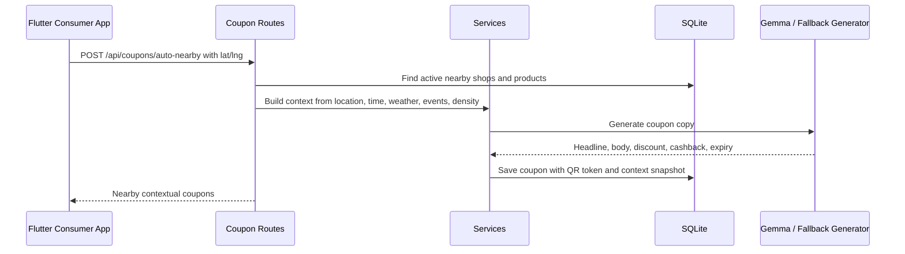
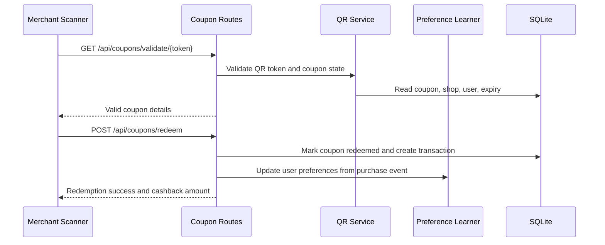
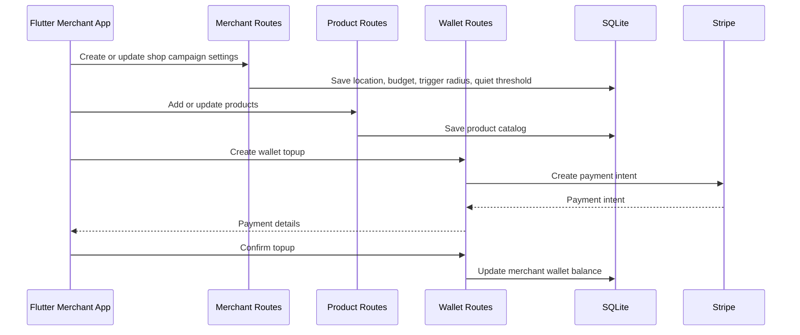
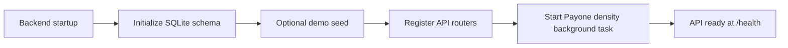

# System Architecture - City Wallet / WayFarer

## Repository Layout

The project is split into two primary application layers:

| Path | Purpose |
|---|---|
| `city-wallet/backend` | Python FastAPI backend, SQLite database, business logic, integrations, and API routes |
| `city-wallet/frontend` | Flutter frontend for consumer and merchant app experiences |

There are also older or alternate app folders such as `city-wallet/mobile` and `city-wallet/flutter`, but the active architecture described here uses `/backend` for the backend and `/frontend` for the frontend.

## Technology Stack

| Layer | Technology |
|---|---|
| Frontend | Flutter / Dart |
| Routing | `go_router` |
| State management | `provider` |
| API client | `dio` |
| Local secure storage | Flutter secure storage service |
| Backend | Python FastAPI |
| Database | SQLite with `aiosqlite` |
| Authentication | JWT bearer tokens |
| AI offer generation | Local Gemma via Ollama-compatible API, with deterministic backend fallback |
| Payments | Stripe |
| Context data | Live frontend location, repeated polling, weather, events, Payone-style density simulation |
| Notifications | Push notification service hook from frontend |

## High-Level Architecture

## Backend Architecture

The backend is a FastAPI application started from `city-wallet/backend/main.py`.

At startup it:

- Initializes the SQLite database from `schema.sql`.
- Applies small compatibility migrations in `database.py`.
- Optionally seeds demo data when `SEED_DEMO_DATA` is enabled.
- Starts a background Payone-density simulation task that updates shop activity every five minutes.
- Registers all API routers.

### Backend Modules

| Module | Responsibility |
|---|---|
| `main.py` | FastAPI app creation, CORS setup, lifespan startup/shutdown, router registration |
| `database.py` | Shared async SQLite connection, schema initialization, runtime migration guards |
| `schema.sql` | Core relational schema and indexes |
| `config.py` | Environment-driven settings for API keys, model endpoints, JWT secret, database URL |
| `routes/auth.py` | Registration, login, user identity, JWT issuance |
| `routes/shops.py` | Map shop listing, shop detail, shop availability and busyness data |
| `routes/coupons.py` | Coupon creation, lookup, QR validation, redemption, auto-nearby coupons |
| `routes/offers.py` | Legacy streaming offer route; depends on Anthropic credentials and is not the active coupon flow |
| `routes/products.py` | Merchant product CRUD |
| `routes/merchants.py` | Merchant shop profile and campaign configuration |
| `routes/wallet.py` | Merchant wallet balance, topups, Stripe payment intent confirmation |
| `routes/analytics.py` | Merchant analytics and performance summaries |
| `routes/context.py` | Weather, time, local event, and nearby context signals |
| `routes/simulation.py` | Demo/simulation endpoints for location and density behavior |
| `routes/webhook.py` | Payment provider webhook entry point |

### Service Layer

The service layer keeps external integrations and business logic out of route handlers.

| Service | Responsibility |
|---|---|
| `context_aggregator.py` | Combines weather, time, events, location, and shop signals |
| `gemma_offer_generator.py` | Active coupon copy generator through a local Gemma endpoint, with fallback logic |
| `offer_generator.py` | Legacy Anthropic streaming helper used only by `routes/offers.py` if credentials are configured |
| `payone_simulator.py` | Simulates transaction density and shop busyness |
| `preference_learner.py` | Updates consumer preference signals from purchase behavior |
| `qr_service.py` | Creates and validates QR redemption tokens |
| `stripe_service.py` | Stripe payment and wallet-related operations |
| `push_service.py` | Push notification dispatch integration |
| `weather_service.py` | Weather signal retrieval |
| `event_service.py` | Local event signal retrieval |
| `osm_service.py` | OpenStreetMap shop/location data support |

## Frontend Architecture

The Flutter app is started from `city-wallet/frontend/lib/main.dart`.

It initializes:

- Stripe publishable key configuration.
- Secure storage.
- `ApiService` with JWT-bearing `dio` interceptor.
- `AuthProvider` from stored session data.
- Notification routing callbacks.
- `GoRouter` navigation.
- Provider-based dependency injection.

### Frontend Modules

| Module | Responsibility |
|---|---|
| `lib/main.dart` | App bootstrap, theme, dependency wiring, route tree |
| `lib/config.dart` | API base URL and frontend configuration |
| `lib/services/api_service.dart` | Typed client methods for backend endpoints |
| `lib/services/storage_service.dart` | Token/session persistence |
| `lib/services/location_service.dart` | Device location access |
| `lib/services/notification_service.dart` | Push notification setup and tap routing |
| `lib/providers/auth_provider.dart` | Login state, user state, auth actions |
| `lib/providers/location_provider.dart` | Current location state |
| `lib/models` | Dart models for users, shops, products, and coupons |
| `lib/screens/auth` | Login and registration |
| `lib/screens/consumer` | Map, shop detail, offer detail, consumer wallet, profile |
| `lib/screens/merchant` | Dashboard, products, campaigns, analytics, scanner, profile |
| `lib/widgets` | Shared coupon and visual components |
| `lib/theme` | App visual theme |

## Location and Polling Architecture

Location is a core input to the system, not a one-time lookup.

The frontend uses `LocationProvider` and `LocationService` to request device location and then subscribe to `Geolocator.getPositionStream`. The stream uses high accuracy and a 15 meter distance filter, so movement updates refresh the in-app location state whenever the user moves meaningfully.

The consumer map also polls the backend every 60 seconds while the map screen is open:

- `POST /api/coupons/auto-nearby` creates or refreshes contextual coupons for the latest latitude/longitude.
- `GET /api/shops/map` reloads nearby shops, active coupons, distance, and busyness information.
- The radius selector can trigger an immediate refresh.
- If no shops are found around the live location, the app can fall back to demo London coordinates for presentation/demo data.

The offer detail screen separately polls every 3 seconds while a coupon is active. This lets the consumer screen notice when a merchant scans and redeems the QR code, then stop polling and show the redeemed state.

## Frontend Navigation

## Data Model

The main database tables are:

| Table | Purpose |
|---|---|
| `users` | Consumer and merchant accounts |
| `merchant_wallets` | Merchant campaign wallet balances |
| `wallet_topups` | Stripe-backed merchant wallet topup records |
| `shops` | Merchant shop profiles, campaign settings, location, budget limits |
| `products` | Merchant products available for offers |
| `coupons` | Generated offers with QR tokens, expiry, status, and context snapshot |
| `transactions` | Redemption records and cashback/payment status |
| `user_preferences` | Learned consumer affinity and spending profile |
| `purchase_events` | Redemption-derived purchase history |
| `payone_density` | Simulated transaction density by shop and time |
| `shop_visits` | Daily user visit tracking |
| `simulated_user_locations` | Demo user location state for simulations |

## Main User Flows

### Authentication Flow

### Consumer Nearby Coupon Flow

### Coupon Redemption Flow

### Merchant Campaign Flow

## Security and Configuration

- The frontend stores auth tokens through `StorageService`.
- `ApiService` attaches JWT tokens to API requests with a `dio` interceptor.
- Backend auth-protected routes use bearer token middleware.
- Runtime secrets and service endpoints are loaded from backend `.env` through `pydantic-settings`.
- Important backend settings include `JWT_SECRET`, `DATABASE_URL`, `GEMMA_BASE_URL`, `GEMMA_MODEL`, Stripe keys, weather keys, and event provider tokens.
- CORS is currently open for hackathon/demo convenience and should be restricted before production deployment.

## Runtime Behavior

## Deployment View

For local development or demo deployment:

| Component | Runtime |
|---|---|
| Backend API | FastAPI app from `city-wallet/backend/main.py` |
| Database | Local SQLite file, usually `city_wallet.db` |
| Frontend | Flutter app from `city-wallet/frontend` |
| AI model | Local Gemma endpoint configured by `GEMMA_BASE_URL` |
| Payments | Stripe test keys through backend environment |

The frontend communicates only with the backend API. The backend owns persistence, offer generation, payment operations, and integration with external services.

## Architectural Boundaries

- Frontend should stay focused on UI, navigation, device capabilities, local auth state, and API consumption.
- Backend should remain the source of truth for users, shops, products, coupons, transactions, wallet balances, and learned preferences.
- AI-generated text should always be validated and bounded by backend rules before being stored or returned.
- Payment and wallet updates should be confirmed server-side before balances or redemption state are trusted.
- Context collection should remain service-based so weather, events, simulation, and model providers can be swapped without changing route contracts.
